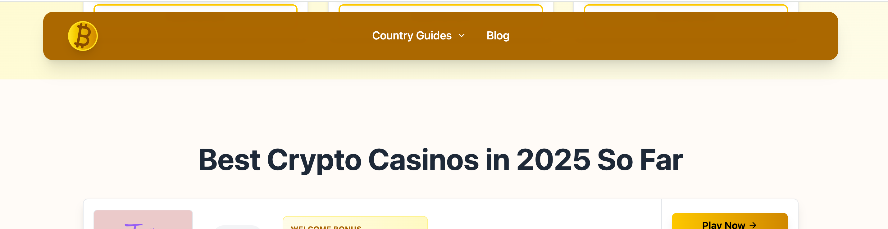
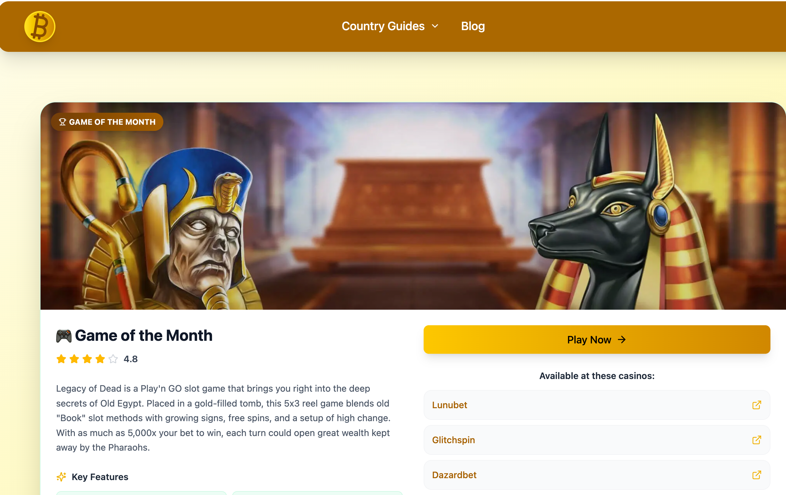

# Contentful Content Migration

## 1. Home Page

### - Casino List:
Update the title to better suit the current application. For example:
> **Best Crypto Casinos in 2025 So Far** -> **Best PayPal Casinos in 2025**

**Related Content Record:** [Casino List Entry](https://app.contentful.com/spaces/m8ssdhfpgciq/entries/2LUlZgwjpI2ofoSkUkpwGM?previousEntries=1ngtIqIFTN5TSdNrUSIwxg)

### - Game of the Month
Update with a new game and ensure all related content fields are updated.

**Related Content Record:** [Game of the Month Entry](https://app.contentful.com/spaces/m8ssdhfpgciq/entries/1J51LiwptNHNZDUYxYGXaM?previousEntries=1ngtIqIFTN5TSdNrUSIwxg&focusedField=title)

### - Content Component
Update the copy to align with the new website.

**Related Content Record:** [Content Component Entry](https://app.contentful.com/spaces/m8ssdhfpgciq/entries/5GVditkiD5fcfcIaaXW18Z?previousEntries=1ngtIqIFTN5TSdNrUSIwxg&focusedField=name)

### - How-to Component
Update the "how-to steps" with accurate data. Consult AI with the prompt: 
> Update this copy for "new-site-category"*

*Replace "new-site-category" with the relevant category for the new website, e.g., PayPal, Revolut, etc.

**Related Content Model:** [How-to Component Entry](https://app.contentful.com/spaces/m8ssdhfpgciq/entries/3EnZZLwC1G2gGRiSnlNNiT?previousEntries=1ngtIqIFTN5TSdNrUSIwxg)

### - Featured Articles
Replace with new articles pertinent to the new website. Ensure there are exactly 4 recently added articles.

### - FAQ Component
Update with new and accurate copy that fits the website.

### - SEO Component
Update with new and accurate copy that fits the website.

**This component is super important, please check format always in SEO components, here slug should be / without domain name or prefixes**

4. 

Content record example:

[Contentful Entry](https://app.contentful.com/spaces/v2w24m9au9in/entries/3S6cSLHZQYs3RpzeYYPONC?focusedField=shortDescription)

Fields we should update:

- Description: Rephrase or create a new one.
- Content: Clean up and create a new version from scratch.
- Payout Limits: Add the correct number.
- Payout Times: Update with relevant information.
- Deposit Methods: Update with the correct options.
- Withdrawal Methods: Ensure accuracy.
- Overviews: Update with a new list of pros and cons that better suit this payment method.
- Reviews: Update with new reviews that align with the current payment method.
- FAQ: Update with new content.
- SEO Component: Update the title and description. The slug should remain as it is.

*Current payment method refers to the new website. For example, we are currently working on the PayPal application.

## 3. FAQ Page

Contentful Entry: [FAQ Page Entry](https://app.contentful.com/spaces/v2w24m9au9in/entries/4WXhS9mMKvPnpdA6zjvH3u)

- Update all FAQ items with new data that will be suitable for the new website.
- Update the SEO component: only the title and description fields.

## 4. Our Methodology

- Update content so it will focus on PayPal instead of Crypto.
- Update the SEO component: only the title and description fields.

## 5. Country Guides Pages

Entry example: [Country Guide Entry](https://app.contentful.com/spaces/v2w24m9au9in/entries/ItmnNeJvfssNiz1JAzJEv?focusedField=name)

- Update the title.
- Update all content components to ensure they relate to the new website topic. (I used the following prompt for ChatGPT: create a detailed article for Ireland about PayPal online casinos, write 1500 - 2000 words with legal information, bonus information, 1-2 interesting games, create a comparison table between PayPal and crypto/Revolut/bank payments - pick one, and provide a summary.)
- FAQ component: please update all FAQ items with new content related to the new website category (e.g., payment/country, etc.).

NOTE: Please maintain the same structure: 1st content component -> short intro -> then Casino List component -> Content component with almost all information except summary -> FAQ -> Summary content component

